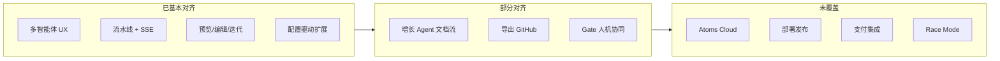

# Atoms Demo 项目简要说明

> 本文档基于仓库当前实现（`README.md`、前后端代码与测试）整理，用于说明 **Atoms Demo** 相对官方 [Atoms](https://atoms.dev/) 的定位、完成度与后续扩展方向。  
> 声明：本项目为独立演示，与 atoms.dev 无关联。

---

## 一、实现思路与相对 Atoms 的关键取舍

### 1.1 项目定位

**Atoms Demo** 是一条「可运行、可自托管、可阅读源码」的多智能体应用生成流水线演示：复刻 Atoms 的核心体验——**多角色协作对话 → 分阶段产出 → iframe 即时预览 → 对话迭代修改**，但刻意缩小到适合本地开发与学习的范围，而非对标 Atoms 的商业化全栈平台。

### 1.2 架构取舍

| 维度 | Atoms（官方产品） | Atoms Demo（本项目） | 取舍理由 |
|------|-------------------|----------------------|----------|
| **部署形态** | 托管 SaaS + Atoms Cloud | Next.js (:3000) + FastAPI (:8000) + 自管 PostgreSQL | 便于 fork、调试、改流水线；不依赖专有云 |
| **生成物形态** | 全栈应用（登录、DB、API、支付、可部署 URL） | **HTML/CSS/JS 单页 + localStorage** 模拟后端 | 零额外基础设施即可演示端到端；模板与 ADR 中明确「Demo 约束」 |
| **编排引擎** | 专有 MetaGPT 系多智能体（并行、Race Mode 等） | **LangGraph 线性 StateGraph**（23 步 + 阶段 Gate） | 步骤可追踪、可测试；Gate 让用户显式 proceed/rollback |
| **智能体定义** | 平台内配置 | **`config/agents.json` 声明式 Schema** + `templates/` 步骤模板 | 单一配置源，前后端通过 `GET /api/config` 共享 |
| **无 API Key 体验** | 需平台账号/额度 | **MockProvider** 走模板渲染，仍可跑完整流水线 | 演示与 CI 不依赖 LLM |
| **LLM 接入** | 多模型、Race Mode 对比 | OpenAI 兼容 API（可选） | 实现简单，够用即可 |
| **平台数据库** | 为每个应用 provisioning 真实 DB | PostgreSQL **只存**用户/对话/项目/Artifact/GeneratedApp | 平台有持久化，生成应用无服务端状态 |
| **增长能力** | SEO/Ads 可执行、落地页、投放 | Iris/Sarah/Adrian **可选流水线**，产出多为文档型 Artifact | 保留角色与步骤，不实现真实营销闭环 |

### 1.3 核心实现路径（简述）

```
用户 Prompt + Theme
    → Conversation 持久化、@Agent 路由
    → POST .../build 创建 Project
    → LangGraph 流水线（Mike→Emma→Luna→Bob→Alex，每阶段末 Gate）
    → 每步 ReAct + SSE 推送 → Artifact 入库
    → Alex assemble → GeneratedApp + ProjectFile
    → iframe 预览 / 设计模式 / 文件编辑 / 对话迭代
```

**设计上的三个「刻意简化」：**

1. **Alex 的「后端」是 Storage Adapter**：Bob/Alex 模板里写 REST 语义，实际落地为 `localStorage`（见 `templates/agents/alex/backend-schema.md`、Mike 风险评估 ADR-001）。
2. **ReAct 是展示层包装**：`react_runner.py` 把单步执行包装为 thought/action/observation，便于 UI 折叠展示，不等于真实 Tool 循环。
3. **双 Cookie 域**：浏览器直连 Python API（SSE 不经 Next 代理），Next 仅镜像 JWT 供 RSC 预取——换取流式体验与架构清晰，代价是 CORS/双域会话要自行维护。

---

## 二、相对 Atoms 的完成程度

### 2.1 已实现（可用、有后端/API 支撑）

| 能力 | 说明 |
|------|------|
| **用户认证** | 注册/登录/登出，JWT `atoms_session`，Next 域镜像 |
| **首页对话工作区** | Dashboard：对话列表、Discover、我的项目、模板 |
| **9 人智能体团队 UI** | `config/agents.json`；`@提及` 路由到不同 `systemPrompt` |
| **核心 5 Agent × 23 步流水线** | Mike / Emma / Luna / Bob / Alex；LangGraph + Artifact 链 |
| **可选 3 Agent** | Iris / Sarah / Adrian：Prompt 关键词触发（调研/SEO/广告） |
| **阶段 Gate** | 每 Agent 结束后 `gate_prompt`；`proceed` / `rollback`；前端 `GateDecisionBar` |
| **SSE 流式** | 流水线 + 项目内对话；ReAct 步骤、handoff、message_delta |
| **统一工作区** | 左对话 + 右应用查看器（预览/设计/编辑器/文件） |
| **iframe 预览** | 后端组装完整 HTML（含设计模式 postMessage 脚本） |
| **视觉设计模式** | 点选元素、CSS 持久化 `POST .../design/styles` |
| **多文件项目树** | `ProjectFile` CRUD；代码编辑器 |
| **对话迭代改代码** | `POST .../chat/stream`；版本递增 |
| **主题系统** | modern / minimal / dark / playful |
| **模板克隆** | 预置 `GeneratedApp`，即时预览 |
| **产物 API** | 按类型查询 Artifact |
| **导出 API** | HTML 打包、`POST .../export/github`（GitHub PAT） |
| **配置校验与测试** | `pnpm validate:config`；pytest + vitest |

### 2.2 部分实现 / 演示级

| 能力 | 现状 |
|------|------|
| **GitHub / HTML 导出 UI** | `GitHubExportModal`、`PreviewPanel` 已实现，**未挂载到主工作区工具栏** |
| **分享 / 发布** | 按钮存在，`title="演示功能 — 即将推出"` |
| **集成栏** | Figma / Notion / Slack 等仅 UI（`IntegrationBar`） |
| **语音输入** | 演示占位 |
| **预览控制台** | 固定文案，不接 iframe 日志 |
| **演示额度** | 侧栏文案，无计费系统 |
| **David（数据分析师）** | 仅首页 @ 对话，**未进流水线** |
| **可选 Agent 价值** | 步骤与模板齐全，产出偏 Markdown 报告，**不驱动应用变更或外部执行** |
| **MCP** | `GET /api/mcp/tools` 返回工具规格；**无 MCP Server 运行时** |
| **RAG** | `backend/README.md` 提及 `rag/indexer.py`，**仓库中无 `rag/` 实现** |

### 2.3 未做（Atoms 核心差异化）

| Atoms 能力 | Atoms Demo |
|------------|------------|
| **Atoms Cloud**（应用级 Auth、PostgreSQL、Storage、Stripe） | ❌ |
| **一键部署 / 预览 URL / 生产环境** | ❌ |
| **生成应用的真实后端 API** | ❌（localStorage） |
| **Stripe 支付** | ❌ |
| **第三方集成（OAuth、AI 模型免 Key 等）** | ❌ |
| **Race Mode（多模型并行对比）** | ❌ |
| **AI 生图 / 资产库** | ❌ |
| **SEO/Ads 真实执行**（索引、投放、追踪） | ❌ |
| **桌面端 / 原生** | ❌（Web Demo） |
| **商业额度与团队协作** | ❌ |

### 2.4 完成度概览（定性）



**一句话**：在「多智能体协作 + 可视化流水线 + 即时预览 + 迭代修改」这条主链路上完成度较高（约 **60–70% 的体验复刻**）；在「可上线、可收费、可增长」的产品闭环上仍是 Demo（约 **15–25%**）。

---

## 三、继续投入的扩展方向与优先级

### P0 — 低成本、立刻提升 Demo 完整度（1–2 周）

| 项 | 内容 | 理由 |
|----|------|------|
| **挂载导出入口** | 在 `AppViewerToolbar` / `ProjectWorkspace` 接入 `PreviewPanel`、`GitHubExportModal` | API 已有，纯 UI 缺口 |
| **强化 assemble 质量** | 有 `OPENAI_API_KEY` 时让 Alex `assemble` 真正解析 LLM JSON/HTML，减少回退到 `get_app_type_template` | 有 Key 时更接近 Atoms「能用的应用」 |
| **Gate 默认可跳过** | 开发模式自动 proceed，生产/演示模式保留 Gate | 降低首次体验摩擦，Gate 仍可作为差异化演示 |
| **补齐测试** | 前端 vitest 覆盖 `useProjectStream`、Gate 交互 | 后续改流水线不易回归 |

### P1 — 缩小与 Atoms 的「可交付」差距（2–6 周）

| 项 | 内容 | 理由 |
|----|------|------|
| **可选真实后端** | Supabase / PocketBase / 轻量 FastAPI CRUD：Bob data-model → 自动建表/REST；Alex 生成 fetch 客户端 | 对齐 Atoms「全栈」叙事，localStorage 可保留为 fallback |
| **预览部署** | 构建产物推 Vercel/Cloudflare Pages，返回 `previewUrl` | 对标 Atoms「Publish」；比自建 Cloud 便宜 |
| **David 进流水线** | 在 Emma 后或 Alex 前插入 analytics 步骤（指标、事件 schema） | 补全 9 人团队中的「数据」环 |
| **RAG 落地** | 实现 `rag/indexer.py`：模板 + 历史 Artifact 检索，注入 LLM context | README 已承诺；提升长 Prompt 一致性 |

### P2 — 增长与集成（按需，6 周+）

| 项 | 内容 | 理由 |
|----|------|------|
| **可选 Agent 可执行化** | Sarah 输出 sitemap/ meta；Adrian 输出 Google Ads CSV；Iris 拉公开网页摘要 | 从「写报告」到「能拿去用一点」 |
| **真实 OAuth 集成** | 先做 GitHub（已有 PAT 基础），再 Notion/Figma 只读 | 对齐 IntegrationBar 承诺 |
| **MCP Server** | 把 `artifact_tools` 跑成真实 MCP，供外部 Agent 调用 | 架构扩展点，非 Demo 必需 |

### P3 — 平台级（长期，投入大）

| 项 | 内容 | 理由 |
|----|------|------|
| **Atoms Cloud 等价层** | 每应用独立 Auth + DB + 文件存储 + 环境隔离 | 与 Atoms 正面竞争所需，Demo 可不做 |
| **Stripe + 多租户计费** | | 商业化范畴 |
| **Race Mode** | 同一步多 Provider 并行，UI 对比选优 | Atoms 高级特性，实现成本高 |
| **并行 Agent 执行** | 当前 LangGraph 线性；Emma/Luna 部分步骤可并行 | 性能与体验优化，复杂度显著上升 |

### 建议路线图

```
现在 Demo  ──►  P0 导出 + assemble  ──►  P1 可选 Supabase + 部署 URL
                                              │
                                              ▼
                                    若目标是「学习多智能体编排」→ 停在这里即可
                                    若目标是「可上线 MVP」→ 继续 P2
                                    若目标是「对标 Atoms 商业产品」→ 需要 P3 + 持续 LLM 成本投入
```

**优先级判断原则：**

1. **体验闭环优先于基础设施**：先让用户「构建 → 预览 → 导出/部署」，再建 Cloud。
2. **配置驱动优先于硬编码**：新 Agent/步骤仍走 `agents.json` + 模板，保持可维护性。
3. **Mock 路径不可丢**：无 API Key 仍能演示完整 23 步，这是本项目相对 Atoms 的独立价值（可离线、可教学）。
4. **不要过早做 Race Mode / 全 Cloud**：投入产出比低，除非产品定位明确转向商业克隆。

---

## 四、技术栈速览

| 层 | 技术 |
|----|------|
| 前端 | Next.js 16 App Router、React 19、Tailwind 4 |
| 后端 | FastAPI、LangGraph、SQLAlchemy + asyncpg |
| 数据 | PostgreSQL（平台元数据） |
| 生成物 | HTML/CSS/JS + localStorage |
| 配置 | `config/agents.json`、`templates/` |
