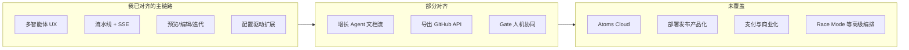

# Atoms Demo — 项目说明

## 一、我做了什么、想对齐什么

我的目标是复刻 Atoms **主链路体验**：用户在对话里描述想法 → 多角色智能体分阶段协作 → 右侧 iframe 即时看到应用 → 继续对话迭代修改。

我没有试图克隆 Atoms 的完整商业平台（托管云、支付、一键上线等），而是做一条 **可 fork、可本地跑通、源码可读** 的流水线 Demo，方便展示编排思路，也便于 CI 和无 API Key 环境下演示。

---

## 二、实现思路与关键取舍

### 2.1 整体架构

我采用 **Next.js（:3000）+ FastAPI（:8000）+ PostgreSQL** 的双服务架构：

```
用户 Prompt + Theme
  → Conversation 持久化、@Agent 路由
  → POST .../build 创建 Project
  → LangGraph 线性流水线（Mike → Emma → Luna → Bob → Alex，每阶段末 Gate）
  → 每步 ReAct 包装 + SSE 推送 → Artifact 入库
  → Alex assemble → GeneratedApp + ProjectFile
  → iframe 预览 / 设计模式 / 文件编辑 / 对话迭代
```

**配置单一来源**：`config/agents.json` 声明 Agent 与步骤，`templates/` 放步骤模板；前后端通过 `GET /api/config` 共享同一份定义。新增 Agent 时我只需改 JSON + 模板，再跑 `pnpm validate:config`。

### 2.2 相对 Atoms，我做的取舍

| 维度 | 我观察到的 Atoms（产品层） | 本项目的做法 | 我为什么这样选 |
|------|---------------------------|--------------|----------------|
| **部署** | 托管 SaaS + 应用级 Cloud | 自托管 Next + FastAPI + 自管 PostgreSQL | Demo 场景要能本地改流水线、看日志，不绑专有云 |
| **生成物** | 全栈应用（真实 Auth、DB、可部署 URL 等） | **HTML/CSS/JS 单页**，数据层用 **localStorage** 模拟 | 零额外基础设施即可跑通端到端；Bob/Alex 模板里仍写 REST 语义，但 Alex 的 backend-schema ADR 明确这是 Demo 约束 |
| **编排** | 多智能体协作（含并行、Race Mode 等高级能力） | **LangGraph 线性 StateGraph**，默认 **23 步** + 阶段 Gate | 步骤可追踪、可单测；Gate 让用户显式 proceed/rollback，便于演示「人机协同」 |
| **Agent 定义** | 平台内配置 | `agents.json` + `templates/` | 声明式、可版本管理，前后端一致 |
| **无 Key 也能演示** | 依赖平台账号/额度 | **MockProvider** 走模板渲染，完整 23 步仍可跑 | CI 和教学场景不依赖 LLM；这是我刻意保留的路径 |
| **LLM** | 多模型、Race Mode | OpenAI 兼容 API（可选） | 实现成本可控，够用即可 |
| **平台库** | 为每个应用 provisioning 真实 DB | PostgreSQL **只存** 用户/对话/项目/Artifact/GeneratedApp | 平台有持久化；**生成出来的应用没有服务端状态** |
| **增长能力** | SEO/Ads 可执行、落地页投放等 | Iris/Sarah/Adrian **可选流水线**，产出多为 Markdown 报告 | 保留角色与步骤结构，不实现真实营销闭环 |

### 2.3 三个我会主动说明的「简化」

1. **Alex 的「后端」是 Storage Adapter**  
   流水线里 Bob 会产出数据模型、Alex 会写 API 规格，但最终落地是 `localStorage`（见 `templates/agents/alex/backend-schema.md`）。这是 Demo 边界，不是我不知道怎么做真实 API。

2. **ReAct 主要是 UI 展示层**  
   `react_runner.py` 把单步执行包装成 thought / action / observation，方便前端折叠展示；**不是**多轮 Tool 循环的 Agent。真实逻辑仍是「一步一模板/LLM 调用 → 写 Artifact」。

3. **双 Cookie 域**  
   SSE 流式我让浏览器 **直连 Python API**（不经 Next 代理），Next 只通过 `POST /api/auth/session` **镜像 JWT** 供 RSC 预取。换取流式体验清晰，代价是 CORS 和双域会话要自己维护——我在 README 里写了这套机制。

---

## 三、当前完成程度

以下均基于 **仓库现有代码与测试** 逐项核对，未标注的我不当作已实现。

### 3.1 已打通（有 API + UI，本地可验证）

| 能力 | 我的实现情况 |
|------|-------------|
| **用户认证** | 注册/登录/登出；JWT `atoms_session`；Next 域 cookie 镜像 |
| **首页对话工作区** | `/dashboard`：对话列表、Discover、我的项目、模板 |
| **9 人智能体 UI** | `config/agents.json`；`@提及` 路由到不同 `systemPrompt` |
| **核心 5 Agent × 23 步流水线** | Mike / Emma / Luna(designer) / Bob / Alex；LangGraph + Artifact 链 |
| **可选 3 Agent** | Iris / Sarah / Adrian：Prompt 含关键词时在 Emma 之后插入（见 `default-pipeline.json`） |
| **阶段 Gate** | 每 Agent 结束后 `gate_prompt`；`proceed` / `rollback`；前端 `GateDecisionBar`；后端有 gate 相关 pytest |
| **SSE 流式** | 流水线 + 项目内对话；ReAct 步骤、handoff、message_delta |
| **统一工作区** | 左对话 + 右应用查看器（预览 / 设计 / 编辑器 / 文件） |
| **iframe 预览** | `GET .../preview`；后端组装完整 HTML（含设计模式 postMessage 脚本） |
| **视觉设计模式** | 点选元素；`POST .../design/styles` 持久化 CSS |
| **多文件项目树** | `ProjectFile` CRUD；代码编辑器 |
| **对话迭代改代码** | `POST .../chat/stream`；`GeneratedApp.version` 递增 |
| **主题** | modern / minimal / dark / playful |
| **模板克隆** | 预置 `GeneratedApp`，可即时预览 |
| **产物 API** | 按类型查询 Artifact |
| **导出 API** | `POST .../preview` 打包 HTML；`POST .../export/github`（GitHub PAT） |
| **配置校验与 CI** | `pnpm validate:config`；GitHub Actions 跑 lint / typecheck / vitest / pytest |

**主链路一句话**：「多智能体协作 → 可视化流水线 → 即时预览 → 对话迭代」这条路径，我认为已经能完整演示。

### 3.2 做了但仍是演示级 / 不完整

| 能力 | 现状（我核实过） |
|------|-----------------|
| **GitHub / HTML 导出 UI** | `GitHubExportModal`、`PreviewPanel` 组件已实现，**但未挂载到** `AppViewerToolbar` / `ProjectWorkspace`；API 可用，入口缺失 |
| **分享 / 发布** | `AppViewerToolbar` 有按钮，`disabled`，`title="演示功能 — 即将推出"` |
| **集成栏** | `IntegrationBar` 仅 UI（Figma / Notion / Slack 等） |
| **语音输入** | 占位，无真实 ASR |
| **预览控制台** | 固定文案，不接 iframe 内 console |
| **演示额度** | 侧栏文案，无计费 |
| **David（数据分析师）** | 首页 @ 对话可用，**未进入**默认流水线（`inPipeline: false`） |
| **可选 Agent 产出** | 步骤与模板齐全，多为 Markdown 报告，**不驱动应用代码变更**，也不调用外部营销 API |
| **MCP** | `GET /api/mcp/tools` 返回工具规格（`mcp_tools/artifact_tools.py`）；**没有** MCP Server 运行时 |
| **RAG** | `backend/README.md` 提到 `rag/indexer.py`，**仓库内无 `rag/` 目录**——文档承诺超前于代码，我会把它标为未实现 |
| **assemble 质量** | 有 `OPENAI_API_KEY` 时走 LLM；若 assemble 解析不出合法 code JSON，会回退合并上游字段或 `get_app_type_template`（见 `graph.py`） |
| **前端测试** | vitest 覆盖了部分 lib；**尚无** `useProjectStream`、Gate 交互的前端测试（后端 gate 测试已有） |

### 3.3 明确未做（Atoms 产品差异化，我未覆盖）

| 能力 | 本项目 |
|------|--------|
| **Atoms Cloud**（应用级 Auth、PostgreSQL、Storage、Stripe） | 未做 |
| **一键部署 / 公开预览 URL / 生产托管** | 未做（仅有 `docs/deploy.md` 自托管说明） |
| **生成应用的真实后端 API** | 未做（localStorage） |
| **Stripe 支付** | 未做 |
| **第三方 OAuth 集成** | 未做（GitHub 导出用 PAT，非 OAuth App 流程） |
| **Race Mode（多模型并行对比）** | 未做 |
| **AI 生图 / 资产库** | 未做 |
| **SEO/Ads 真实执行**（索引、投放、转化追踪） | 未做 |
| **桌面端 / 原生客户端** | 未做 |
| **商业额度、团队协作、多租户** | 未做 |

### 3.4 完成度怎么理解（主观，供参考）

我不给精确的「百分之几」，避免误导。若按 **体验复刻**（主链路能不能跑、像不像 Atoms 的构建流程）衡量，我认为 **主链路完成度较高**；若按 **可上线商业产品**（Cloud、支付、部署、增长闭环）衡量，这仍是 **Demo 级别**。



---

## 四、若继续投入，我会如何扩展（优先级）

以下是我 **基于当前代码缺口** 排的序，不是官方路线图。

### P0 — 低成本、立刻提升 Demo 完整度（约 1–2 周）

| 优先级 | 做什么 | 为什么先做 |
|--------|--------|-----------|
| 1 | 在 `AppViewerToolbar` 挂载 `PreviewPanel`、`GitHubExportModal` | API 和组件都有了，纯 UI 接线 |
| 2 | 强化 assemble：有 Key 时提高 LLM JSON 解析成功率，减少回退模板 | 有 Key 时更接近「能用的应用」 |
| 3 | Gate 可配置：开发模式自动 proceed，演示/生产保留 Gate | 降低首次体验摩擦，Gate 仍可作为差异化 |
| 4 | 补前端测试：`useProjectStream`、Gate 交互 | 后端 gate 已有测试；改 SSE 前端易回归 |

### P1 — 缩小「可交付应用」差距（约 2–6 周）

| 优先级 | 做什么 | 为什么 |
|--------|--------|--------|
| 1 | **可选真实后端**：Supabase / PocketBase / 轻量 CRUD；Bob data-model → 建表/REST；Alex 生成 fetch 客户端 | 对齐「全栈」叙事；localStorage 可保留 fallback |
| 2 | **预览部署**：产物推 Vercel / Cloudflare Pages，项目字段存 `previewUrl` | 对标 Atoms「Publish」；比自建 Cloud 便宜 |
| 3 | **David 进流水线**：在 Emma 后或 Alex 前加 analytics 步骤 | 补全 9 人团队里的「数据」环 |
| 4 | **RAG 落地**：实现 README 提到的 indexer；模板 + 历史 Artifact 检索 | 长 Prompt 时提升步骤间一致性 |

### P2 — 增长与集成（按需，6 周+）

| 项 | 内容 |
|----|------|
| 可选 Agent 可执行化 | Sarah 输出 sitemap/meta；Adrian 输出 Ads CSV；Iris 拉公开网页摘要 |
| 真实 OAuth | 先做 GitHub（已有 PAT 基础），再 Notion/Figma 只读 |
| MCP Server | 把 `artifact_tools` 跑成真实 MCP，供外部 Agent 调用 |

### P3 — 平台级（长期，投入大，Demo 通常不做）

| 项 | 内容 |
|----|------|
| Atoms Cloud 等价层 | 每应用独立 Auth + DB + 文件存储 + 环境隔离 |
| Stripe + 多租户计费 | 商业化范畴 |
| Race Mode | 同一步多 Provider 并行，UI 对比选优 |
| 并行 Agent | 当前 LangGraph 线性；Emma/Luna 部分步骤理论上可并行，复杂度显著上升 |

### 我的优先级原则

1. **体验闭环先于基础设施** — 先「构建 → 预览 → 导出/部署」，再建 Cloud。  
2. **配置驱动优先于硬编码** — 新 Agent/步骤仍走 `agents.json` + 模板。  
3. **Mock 路径不能丢** — 无 API Key 仍能跑完整 23 步，这是 Demo 的独立价值。  
4. **Race Mode / 全 Cloud 不要过早做** — 除非产品定位明确转向商业克隆，否则投入产出比低。

```
当前 Demo
  → P0：导出入口 + assemble 质量 + 测试
  → P1：可选 Supabase + 部署 URL
       ├─ 目标「学习多智能体编排」→ 可停在这里
       ├─ 目标「可上线 MVP」→ 继续 P2
       └─ 目标「对标 Atoms 商业产品」→ 需要 P3 + 持续 LLM 成本
```

---

## 五、技术栈（速览）

| 层 | 技术 |
|----|------|
| 前端 | Next.js 16 App Router、React 19、Tailwind 4 |
| 后端 | FastAPI、LangGraph、SQLAlchemy + asyncpg |
| 数据 | PostgreSQL（平台元数据） |
| 生成物 | HTML/CSS/JS + localStorage |
| 配置 | `config/agents.json`、`templates/` |

更细的 API、环境变量、流水线步骤表见根目录 [README.md](../README.md) 与 [backend/README.md](../backend/README.md)。
